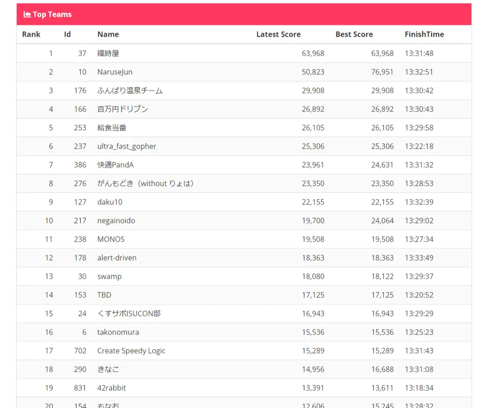

## ふりかえり

[ISUCON 13](https://isucon.net/archives/57801192.html)にdaku10という1人チームで参加しました。使用言語はGoを選択し、最終的なスコアは**30,518**でした。ISUCON参加歴は3回目で、ISUCON 11予選、ISUCON 12予選に続いての参加です。ざっくり良かったことと悪かったことを挙げておきます。

### 良かったこと
- 初速はよく出せた(13:30時点では9位にいた)
  - 素振りの効果で、最初の定型的な作業はスムーズにできた
  - 事前準備していたスクリプト・ツールが役立った
- AIサービスの使用が許可されていたので、使える範囲で上手く活用できた
- 最近の運動の成果か、ある程度の集中力を保ったまま、最後まで参加できた
  - 前回のISUCON 12予選では、途中で集中力を失って後半何もできなかった
- **何より楽しかった**

### 悪かったこと
- 初速以降のスコアが伸びなかった
  - まだまだ力量不足、手を動かす速度を上げることと、レパートリーを増やすことが必要
- 途中で大きな手戻りが発生した
  - 事前作成したスクリプトのミスで、最高スコアのコミットに巻き戻せなかった(16:24頃37,507点を出していた)
    - これは事前にテストしておけば気づけたので、とても悔しい
- 通常時ならば落ち着いて対応できる問題が、緊張感のある状況下で対応できなかった
  - PowerDNSを別のインスタンスのMySQLに向ける際、`bind-address`の設定を忘れて繋がらないことの対応が遅れた
  - PowerDNSの再起動をしたいのに、`sudo systemctl restart poweroff.target`と打ってしまい、インスタンスが落ちてしまった
    - `power`からのTabキーの補完で間違えた(正解は`pdns.service`)
    - 何回も入力することになるので、スクリプトの方に書くのが良かった
- 事前準備していたスクリプト・ツールが複数台構成を想定しておらず、使いにくかった
  - 複数台構成の素振りもしておく


## 当日以前

### 参加登録

初回の参加受付で参加登録をしたのですが、50秒ほどで予定枠が埋まるほどの人気でした。登録にはGitHub連携とDiscord連携が必要になるので、時間内に登録するには、予めそれらにログインした状態であることが、ほぼ必須だと思います。自分はアバター登録の箇所で手間取ってしまいましたが、無事id=127で登録が完了しました。(中々キリの良い数字ですね)

### 素振り

[private-isu](https://github.com/catatsuy/private-isu)と[ISUCON 12予選](https://github.com/isucon/isucon12-qualify)の素振りをしました。private-isuに関しては、大雑把な流れを思い出すことを目的に、[達人が教えるWebパフォーマンスチューニング](https://gihyo.jp/book/2022/978-4-297-12846-3)を読みながら、書籍内でprivate-isuを解く箇所をGoで実装していきました。ISUCON 12予選に関しては、スクリプト・ツールを育てることを目的にしつつ、時間を制限して本番に近い環境で素振りをしました。

### スクリプト・ツールの作成

ISUCON中は定形作業(デプロイ、ログ取得、ミドルウェアの再起動、etc.)が多く、それらを低減するために、各チームはスクリプト・ツール等を用意することが多いのではないでしょうか。色々用意して専用のリポジトリを作っていたのですが、いくつかピックアップしておきます。リポジトリごと公開したいのですが、秘匿情報なども全部突っ込んでいたため紹介にとどめておきます。

#### Task

タスクの実行に去年は`make`を使っていたのですが、今年は[Task](https://taskfile.dev/)を使うことにしました。理由は新しいものを使ってみたかっただけです。とはいえ、個人的には感触は良く、今回の目的ならば`make`よりは使いやすいと感じました。

##### 良かった点

- タスクランナーとして設計されているので、`.PHONY`のようなものが不要
- タスク実行ディレクトリを指定する[dir](https://taskfile.dev/usage/#task-directory)が便利

##### 悪かった点

- 個人的にYAMLは書きにくいと感じた

以下のように、素振り中に名前が変わりそうなものは変数として定義して作っておいたので、最小限の変更で本番に対応できました。
```yaml title="Taskfile.yml"
version: '3'
vars:
  REPOSITORY_ROOT: /home/isucon/webapp
  APP_SERVICE: isupipe-go.service

tasks:
  deploy:
    desc: deploy app
    dir: "{{.REPOSITORY_ROOT}}/go"
    deps: [log_reset]
    cmds:
      - git pull
      - make build
      - sudo systemctl restart {{.APP_SERVICE}}
```

#### slackcat

他チームのISUCONのふりかえりを読んでいたら、[slackcat](https://github.com/bcicen/slackcat)というツールが便利そうだったので、使ってみることにしました。ただ、自分の環境下ではOAuth周りの設定が上手くいかず、結局使えませんでした。[^1]

使ってみようと思ったのが直前だったこと、ただalp, slow query logをSlackに流す機能だけが欲しかったので、自分で作りました。[slack-go](https://github.com/slack-go/slack)があるので、ChatGPTの力を借りつつ50行ほどで実装でき、本番でも大いに役立ってくれました。

[^1]: しっかり追っていないのですが、それらしい[issue](https://github.com/bcicen/slackcat/issues/93)は上がっており、書かれている解決策も自分には解決できませんでした。

## 当日

Slackに残したログやGitHubの履歴から書き起こした、ざっくりとした流れを書いておきます。

### 10:00 - 10:45(4,666)

スクリプトを使って、各種ミドルウェアの整備をしました。MySQLの負荷がそこそこありそうだったので、とりあえずアプリケーションとDBを分けることに決め、その作業が10:45頃に終わりました。ありがちですが、MySQLのユーザーの権限周りで少しハマりました。また、DBを分けたあとに、スクリプトが複数台構成を想定していないことに気づきました。これを直す時間はないと判断し、最後までターミナルを行ったり来たりすることになりました。

### 10:45 - 13:30(22,155)

ボトルネックになっていそうだった、スロークエリの対処とimage周りの対処をしていました。image周りはnginx側で対処したかったのですが、上手く行かず、アプリケーション側で対処することにしました。ただ、アプリケーション側も上手く実装できず、DBにimageは入ったまま、オンメモリにできる部分はする、という悲しい実装でした。ここは純粋に練習不足です。とはいえ、この時点で9位にいたので、初速は良かったと思います。(嬉しくてスクショ取っていました、トップ層に関しては何も言葉がありません)



### 13:30 - 15:00(26,221)

この時間はN+1を潰そうとしていましたが、まともに潰せず悲惨な状態でした。焦って適当なキャッシュを入れて、結局初期化時にキャッシュをリセットし忘れてFailをやらかすなど、ほとんど進捗がなく、悔しい時間でした。

### 15:00 - 16:30(37,507)

確かこのあたりで、アプリケーションサーバーの負荷のうち、MySQLが高くなっていることに気づきました。MySQLのスロークエリログを見たところ、DNS周りっぽいクエリが流れていました。正直この辺は全く知識がないのですが、マニュアルにPowerDNSを使っていると書いてあったので、ChatGPTにずっと聞いていました。設定ファイルのどこを直せば高速化するか、別のDBに向けることができるか、などを聞いていました。この時間帯で、`bind-address`の設定を忘れて繋がらないことや、PowerDNSの再起動をしたいのに、`sudo systemctl restart poweroff.target`を打つなどをやらかしました。あまり高速化の方法は分かりませんでしたが、とりあえずスロークエリを潰すようにしたこと、アプリケーション側も地味に修正して、当日最高の37,507点を出しました。

### 16:30 - 18:00(30,518)

ここから先はあまり記録が残っていません。とりあえずボトルネックになっていそうだったN+1を潰そうと色々やっていました。ベンチを回すのにどうしても時間がかかってしまうため、一辺にたくさんの箇所を修正していました。問題があったら後で戻せばいいや、という考えでした。ただ、ここで大きくミスをしており、最高スコアのコミットにすら巻き戻せない状態になってしまいました。というのも以下のTaskで、コミットハッシュとスコアをSlackに投稿するように管理していました。

```yaml title="Taskfile.yml"
  slack_score:
    desc: send score to slack
    dir: "{{.REPOSITORY_ROOT}}"
    cmds:
      - |
        echo "input score of the commit"
        read score
        echo "{{.GIT_COMMIT}}: $score" | slackcat score_`date "+%Y%m%d_%H%M%S"`
    vars:
      GIT_COMMIT:
        sh: git log -n 1 --format=%h
```

問題なのは、このTaskfileはisucon13のリポジトリと別のツール・スクリプト類をまとめるリポジトリで管理していました。そのため、ここで得られるコミットハッシュはisucon13のものではなく、このTaskfileのものでした。素振り中は結局ベンチがすぐ周りこともあり、コミットを戻すようなことがなかったため、気づけませんでした。これは事前にテストしておけば気づけたので、とても悔しいです。何とか0点は回避しようと、大分前のコミットに戻して、最終的に30,518点で終わりました。

## 最後に

あらためて書き出してみると、できたことが少なく、手戻りやミスが多かったと感じます。ただ、それでもとても楽しかったのは間違いありません。運営に携わられた方々本当にありがとうございました。
