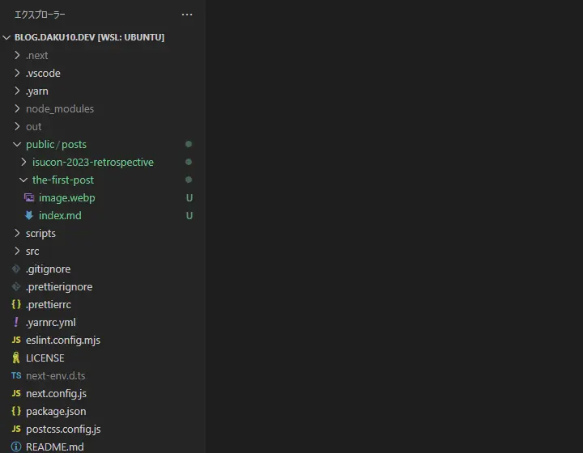

## はじめに

はじめまして、daku10と申します。私は[Zenn](https://zenn.dev/daku10)に時々技術記事を書いていたのですが、この度専用のブログを作ることにしました。色々と理由はあるのですが、主な理由はこんなところでしょうか。

- 自分が学んだことをアウトプットする場所が欲しい
- 他の人の記事で勉強になることが多いので、自分もそういう記事を書きたい
- 完全な技術記事だけでなく、雑記も書きたい
- **一度作ってみたかった**

住み分けとしては、人に広めたい技術記事はZennに書き、それ以外はこちらに書こうと思っています。今回は初めての投稿ということで、使用した技術スタックの紹介をしていきます。

## 技術スタック

今回は以下のような技術スタックでブログを作りました。

### フレームワーク

単にブログを作る際の技術選定では、様々な選択肢がありますが、今回はNext.jsのApp Router + Static Exportベースで作りました。フロントエンドの界隈では、今後数年間はNext.jsが主流になると考えていること、主軸に据えられるApp Routerを触ってみたかったことから、この選択を取りました。現状Static Exportで十分なのですが、現時点でもReact Server Componentsが動作する、Route HandlersでRSS Feedを生成するなど新機能で遊べています。

### コンテンツ管理

ヘッドレスCMS等で管理することも考えましたが、今回はMarkdownを直接リポジトリに置く方法を取りました。そして、このMarkdownですが、画像をどう扱うかなどを考えた結果、Next.jsが管理する`public`直下へ置くことにしました。このような構成になっています。



Markdown内の画像を指す記法は、``と書いています。この構成にすることで、Next.js上での表示も、Markdownのプレビュー上で画像の確認もできるようにしました。

この少々hackyなアイデアは、Dan Abramov氏の[Overreacted.io](https://overreacted.io/)を真似たものです。ただ、彼のサイトでは、Next.jsの`trailingSlash`を有効にすることで、Markdown中の`./image.png`をそのまま表示できる仕組みになっていました。

ただ、私は`trailingSlash`を有効にするのを避けたかったので、MarkdownからReactコンポーネントに変換する際、この画像のパスを変更するようにしました。MarkdownからReactコンポーネントへの変換は、[unified](https://unifiedjs.com/)を利用し、Markdown → mdast → hast → ReactElementに変換しています。そのため、hastの操作として画像のパスを変更するようなプログラムを書きました。

```ts title="src/lib/processor.ts"
import type { Plugin } from "unified";
import { visit } from "unist-util-visit";
import type { Root } from "hast";

const myRehypeRewriteImgPath: Plugin<[], Root> = () => {
  return (tree, file) => {
    visit(tree, "element", (node) => {
      // TypeScriptの型の都合上、少し冗長な書き方になっています
      if (
        node.tagName === "img" &&
        typeof node.properties["src"] === "string" &&
        node.properties["src"].startsWith("./") &&
        typeof file.data["slug"] === "string"
      ) {
        node.properties["src"] = `./${file.data["slug"]}/${node.properties[
          "src"
        ].substring(2)}`;
      }
    });
  };
};

export const processor = unified()
  .use(remarkParse)
  .use(remarkRehype)
  .use(myRehypeRewriteImgPath)
  .use(rehypeReact, production);
```

```tsx title="src/app/posts/[slug]/page.tsx" {6-11}
import { processor } from "@/lib/processor";

export default async function Page({ params }: Props) {
  const { slug } = params;
  const post = await retrievePost(slug);
  const processedContent = await processor.process({
    data: {
      slug,
    },
    value: post.content,
  });

  // ...
}
```

上記のようにunifiedのprocess時に任意のデータが渡せそうだったので、実現できました。現在はこれに加えて`width`や`height`の指定や、`loading="lazy"` の追加なども行っています。

この方法は、`index.md`が直接外に露出することとなるのですが、そもそもGitHubで公開しているので、今回は良しとしました。今後、画像をCDNで扱いたい、ファイルのキャッシュをコントロールしたいなどの理由が出てきた際には、この部分を変更しようと考えています。

### スタイリング

スタイリングはTailwind CSSを採用しました。その理由として、デザイン周りは不得意なので、既存のデザインのエコシステムに乗るためです。色々なコンポーネントライブラリを参考にしつつ、簡素なデザインで作りました。

また、Markdownから最終的に生成されるHTMLのスタイリングに[@tailwindcss/typography](https://tailwindcss.com/docs/typography-plugin)を利用しており、ある程度いい感じにスタイリングしてくれています。その他コードのシンタックスハイライト等含め、微調整をしました。この辺りの調整は、先人の知恵を参考にさせていただき、ページの末尾に記載しています。

### デプロイ

デプロイはCloudflare Pagesを利用しています。Next.jsなので、Vercelが第一候補ですが、以下の理由からCloudflare Pagesを採用しました。

- Cloudflare周りのサービスを使ってみたかったこと
- 無料プランでの制限が少ないこと
- ドメインをCloudflareで管理していたこと

少し触っただけですが、以下のような点が気に入っています。

- GitHubとの連携が簡単
- Cloudflare Accessとの連携で、メールアドレス認証の導入が簡単

他にも面白そうな機能が多く提供されており、機会があれば使ってみようと考えています。

また、Terraformを使って管理をしており、そこで得られた知見は今後の記事で紹介していきたいと考えています。

## おわりに

このブログを支える細かい技術は、今後の記事で紹介できればと考えています。また、今後このブログに以下のような機能を追加していく予定です。

- リンクカード
- 目次(ToC)
- 検索機能

ブログのソースコードは[GitHub](https://github.com/daku10/blog.daku10.dev)で公開しています。ブログは更新していくことが大事だと考えているので、無理しない程度で更新していきます。

## 参考

今回このブログの作成にあたり、多くの記事を参考にしました。その中でも特に参考にした記事を以下にまとめておきます。

- [Next.js Blog Example With Markdown](https://next-blog-starter.vercel.app/)
- [Overreacted.io](https://overreacted.io/)
- [@tailwindcss/typography 使用時のインラインコードのバッククォートを除去する](https://osgsm.io/posts/tailwindcss-typography-remove-backticks)
- [Rehype Pretty Code で、コードブロックに行番号を付け、特定の行をハイライトする](https://osgsm.io/posts/rehype-pretty-code-additional-settings)
